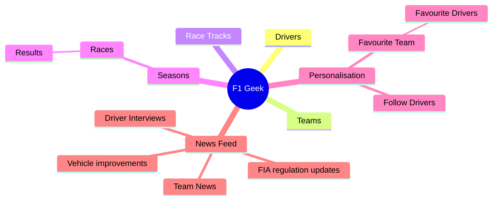
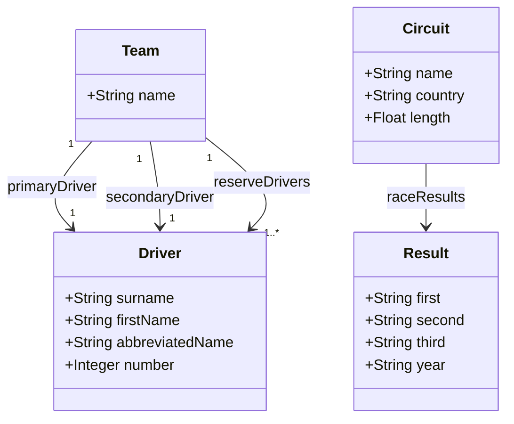

# F1Geek

## Introduction

Source for the F1Geek android app.

## Student Information

| Field          | Value          |
|----------------|----------------|
| Name           | Shane Whitmore |
| Student Number | 20098910       |

## MindMap

## Initial Data Model

