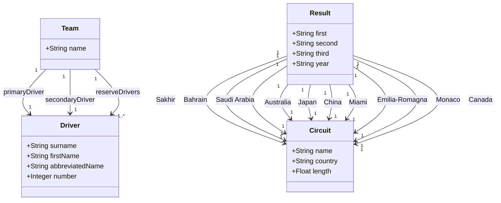

# F1Geek

## Introduction

Source for the F1Geek android app.

## Student Information

| Field          | Value          |
|----------------|----------------|
| Name           | Shane Whitmore |
| Student Number | 20098910       |

## User Stories

### As a Formula 1 fan ...
<ul>
  <li>As a Formula 1 fan, I want to see a list of drivers so that I can see who is competing in the championship.</li>
  <li>As a Formula 1 fan, I want to see a list of teams so that I can see who is competing in the championship.</li>
  <li>As a Formula 1 fan, I want to drill down into a driver so that I can see more information about them.</li>
  <li>As a Formula 1 fan, I want to drill down into a team so that I can see more information about them, including their drivers.</li>
</ul>

### As Someone who is new to Formula ...
<ul>
  <li>As Someone who is new to Formula 1, I want to see a list of rules that the drivers must follow so that I can understand how formula 1 works.</li>
  <li>As Someone who is new to Formula 1, I want to see a list of rules that the teams must follow when making the cars so that I can understand the design choices of the teams.</li>
  <li>As Someone who is new to Formula 1, I want to see a list of drivers so that I can learn who participates in Formula 1.</li>
</ul>

### As a Formula 1 Expert ...
<ul>
  <li>As a Formula 1 Expert, I want to drill down into a cars so that I can see more information about them.</li>
  <li>As a Formula 1 Expert, I want to drill down into a Circuits in the season so that I can see more information about previous races, including the winners and year.</li>
  <li>As a Formula 1 Expert, I want to drill down into a team so that I can see more information about them, including their manager and sponsors.</li>
</ul>

## MindMap

## Initial Data Model

## UI Concept Design

  
  

